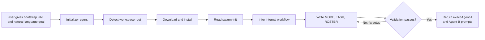
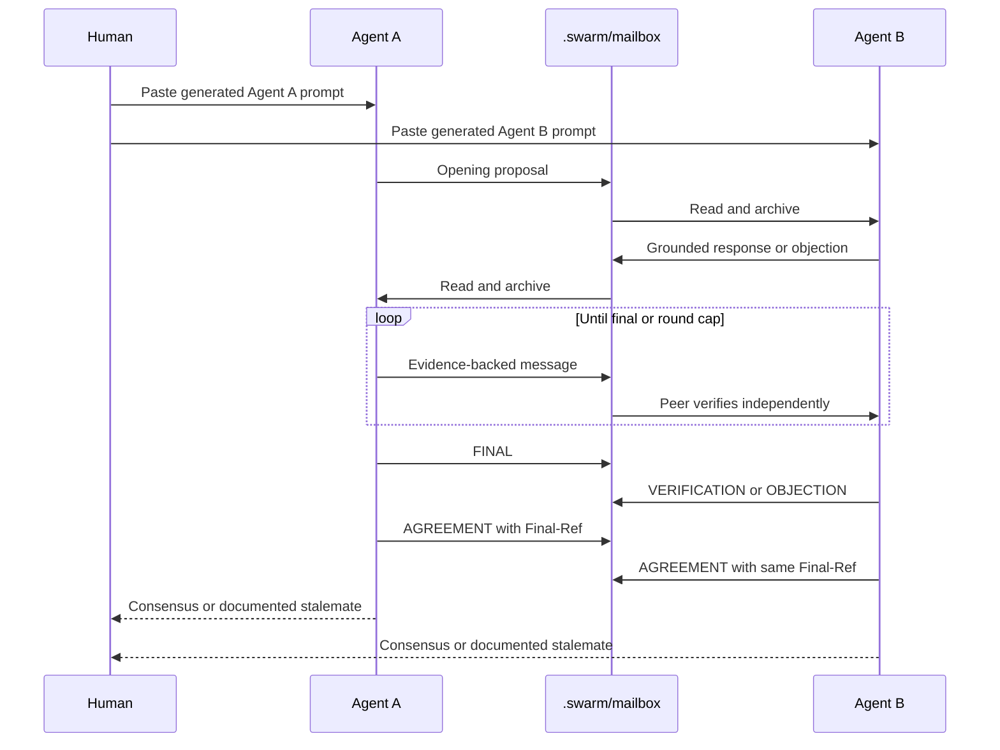

# agent-swarm

A portable protocol for two AI agents collaborating in one workspace. Agents
plan, review, or brainstorm through an auditable filesystem mailbox—without a
server, daemon, API, or vendor-specific runtime.

It works with any agent that can read workspace files and run a POSIX-style
shell. The installer adds standard `.agents/skills` for Codex and GitHub
Copilot, native skill copies for Claude Code, Cursor rules, and generic
`AGENTS.md` guidance.

## Agent-first installation

Give one agent this prompt from inside the target workspace:

```text
Read and follow this bootstrap document exactly:

https://raw.githubusercontent.com/danielifshitz/agent-swarm/main/BOOTSTRAP.md

Prepare a two-agent swarm for this task:

<describe the task here>
```

The initializer discovers the workspace root, installs agent-swarm, understands
the requested outcome, infers the internal workflow, writes all run files,
validates them, and returns exact prompts for Agent A and Agent B. The user does
not choose a protocol mode or edit configuration files.



This path works with Codex, Claude Code, Cursor, and GitHub Copilot Agent mode.
Terminal execution may require the user's normal approval. Agent A and Agent B
must be independent sessions sharing the same local checkout; separate cloud
agents usually do not share a filesystem.

## Manual installation

From a clone:

```sh
git clone https://github.com/danielifshitz/agent-swarm.git
agent-swarm/install.sh /path/to/your/workspace
```

Or install into the current Git repository root (falling back to the current
directory outside Git):

```sh
curl -fsSL https://raw.githubusercontent.com/danielifshitz/agent-swarm/main/install.sh | sh
```

To target another workspace explicitly:

```sh
curl -fsSL https://raw.githubusercontent.com/danielifshitz/agent-swarm/main/install.sh |
  sh -s -- /path/to/your/workspace
```

For a fork, set `SWARM_GITHUB_REPO=owner/repository` and optionally
`SWARM_REF=branch`. Packagers can set `SWARM_ARCHIVE_URL` to a complete source
archive URL.

## Initialize manually with `$swarm-init`

After installation, ask an agent in the target workspace:

```text
Use $swarm-init to prepare this task for two collaborating agents: <your task>
```

The initializer infers the internal workflow and writes a concrete task and
matching roster. To prepare the files without skill invocation, fill in
`.swarm/TASK.md`, `.swarm/ROSTER.md`, and `.swarm/MODE`, then run:

```sh
.swarm/swarm validate
.swarm/swarm prompts
```

Invoke `$swarm` only inside a prepared run after assigning that session either
`agent-a` or `agent-b`. Never let sessions infer their identities.

## Runtime lifecycle



The filesystem mailboxes are single-writer/single-reader channels. Messages are
written through a unique temporary file and atomically renamed, then archived
without deletion after processing.

## Mailbox command

```sh
printf '%s\n' 'Finding grounded at src/auth.py:88.' |
  .swarm/swarm send --from agent-b --to agent-a \
    --status OBJECTION --round 1

.swarm/swarm inbox agent-a
.swarm/swarm wait agent-a 900
.swarm/swarm read agent-a MESSAGE_FILENAME.md
.swarm/swarm archive agent-a MESSAGE_FILENAME.md
.swarm/swarm transcript
```

Run `.swarm/swarm help` for the complete command list.

## Installation options

```sh
./install.sh . --adapters all
./install.sh . --adapters standard,claude
./install.sh . --adapters none
./install.sh . --force
```

| Adapter | Installed path |
|---|---|
| `standard` | `.agents/skills/{swarm,swarm-init}/` |
| `claude` | `.claude/skills/{swarm,swarm-init}/` |
| `cursor` | `.cursor/rules/{swarm,swarm-init}.mdc` |
| `agents-md` | Standard skills plus guarded `AGENTS.md` guidance |

Re-running the installer upgrades the protocol, command, and adapters while
preserving `.swarm/TASK.md`, `.swarm/ROSTER.md`, and `.swarm/MODE`. Use
`--force` only when intentionally resetting those three files.

## Internal workflows

- `review`: an author fixes numbered findings from a read-only reviewer.
- `plan`: symmetric critique produces an agreed plan or precise edit list.
- `brainstorm`: independent generation happens before evaluation, preserving
  unresolved differences rather than forcing consensus.

These names are internal protocol state. `$swarm-init` infers the appropriate
workflow from the requested outcome; the user never needs to select one.

## Development

```sh
sh tests/test.sh
```

CI and the local suite cover clean and streamed installation, Git-root
detection, configuration-preserving upgrades, skills and adapters, task/roster
validation, prompt generation, mailbox collisions, timeout behavior, archive
and transcript behavior, and the agent bootstrap contract on macOS and Linux.

## License

MIT
